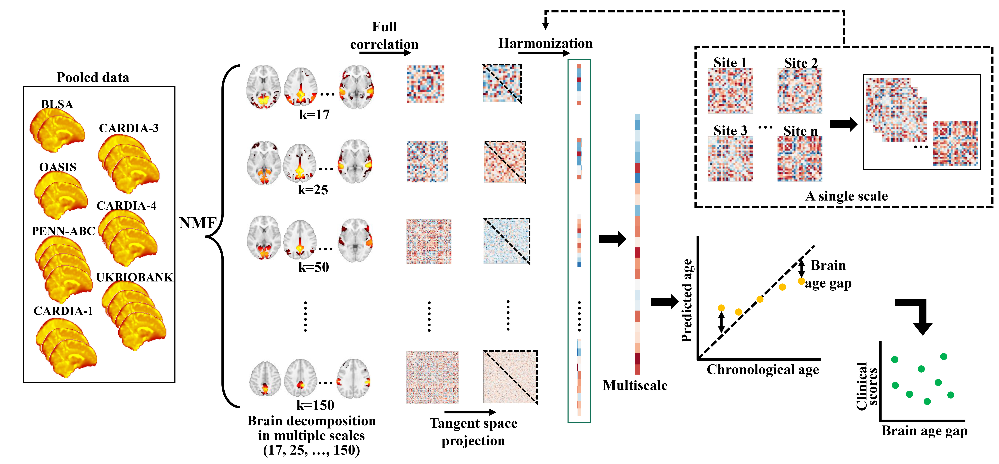

# Mutliscale brain aging patterns
 
This repository contains the codes and example data underlying our recent papers:

[Zhou Z, Li H, Srinivasan D, Abdulkadir A, Nasrallah IM, Wen J, Doshi J, Erus G, Mamourian E, Bryan NR, Wolk DA, Beason-Held L, Resnick SM, Satterthwaite TD, Davatzikos C, Shou H, Fan Y; Multiscale functional connectivity patterns of the aging brain learned from harmonized rsfMRI data of the multi-cohort iSTAGING study. Neuroimage. 2023 Apr 1;269:119911. doi: 10.1016/j.neuroimage.2023.119911. Epub 2023 Jan 30. PMID: 36731813; PMCID: PMC9992322.](https://www.sciencedirect.com/science/article/pii/S1053811923000599)

[Zhou Z, Srinivasan D, Li H, Abdulkadir A, Shou H, Davatzikos C, Fan Y; ISTAGING Consortium. Harmonization of multi-site functional connectivity measures in tangent space improves brain age prediction. Proc SPIE Int Soc Opt Eng. 2022 Feb-Mar;12036:1203608. doi: 10.1117/12.2611557. Epub 2022 Apr 4. PMID: 36845412; PMCID: PMC9951555.](https://www.spiedigitallibrary.org/conference-proceedings-of-spie/12036/1203608/Harmonization-of-multi-site-functional-connectivity-measures-in-tangent-space/10.1117/12.2611557.full)

# When you encounter issues

This code was written by Dr. Zhen Zhou.
